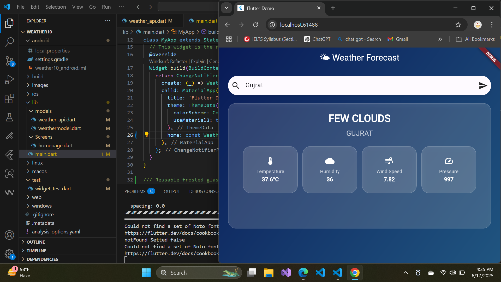

# 🌤️ WeatherApp

A beautifully designed Flutter Weather App that fetches real-time weather data using the [OpenWeatherMap API](https://openweathermap.org/api) and manages state efficiently with the **Provider** package.

---

## 📱 Screenshots

<p align="center">
  
  
</p>

---

## 🚀 Features

- 🔍 Search weather by city name  
- ☁️ Real-time weather updates  
- 📊 Displays temperature, humidity, wind speed, and pressure  
- 🧊 Glassmorphism UI for modern design  
- 🧩 State management using `Provider`  
- 🌈 Beautiful gradient backgrounds

---

## 🛠️ Tech Stack

- **Flutter**  
- **Provider (State Management)**  
- **OpenWeatherMap API**  
- **Dart**  
- **Custom Glassmorphism Widgets**

---

## 📦 Installation

1. **Clone the repository:**

```bash
git clone https://github.com/your-username/WeatherApp.git
cd WeatherApp
